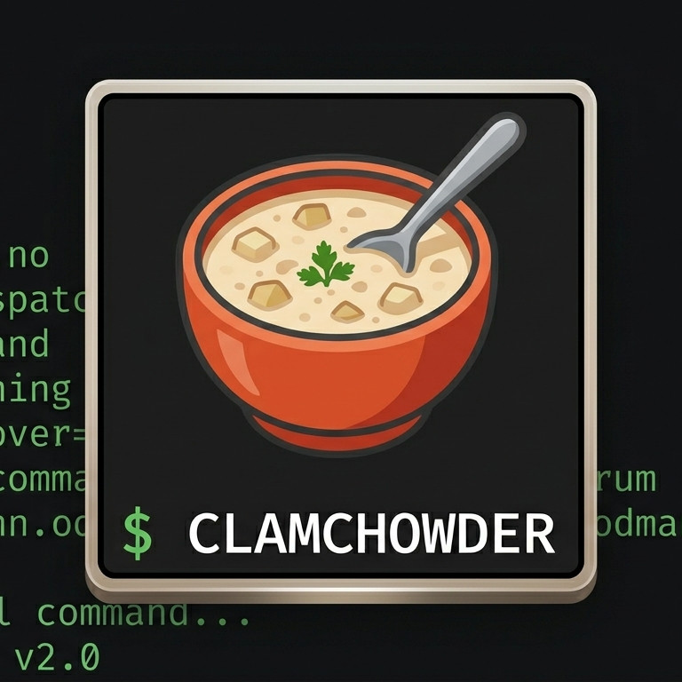

# ClamChowder 🥣🐚

<p align="center">
  
</p>

**ClamChowder** is a zsh-based meta-framework for managing standardized operational commands. 

It streamlines the creation of routine scripts, allowing you to bundle execution logic, configuration, and documentation into a single, portable unit.

## ✨ Features

- **Standardized Scaffolding**: Create consistent command structures instantly.
- **System Integration**: Easily register your scripts as system-wide commands via symlinks.
- **Dynamic Docs**: Integrated [mo](https://github.com/tests-always-included/mo) for rendering templates.
- **Zsh-Native**: Built with Zsh for robust and modern shell scripting.

## 🏗️ Command Structure

Commands cooked by ClamChowder follow this layout:

```text
<cmd_name>/
├── bin/          # Execution logic (main)
├── config/       # Configuration values
├── doc/          # Documentation (Mustache templates)
└── sql/          # Raw data or query templates
```

## ⚙️ Installation

1. **Clone** the repository to a stable location:
   ```bash
   git clone --recursive git@github.com:urchin-hat/clamchowder.git /usr/local/etc/project/clamchowder
   ```

2. **Link** the main script to your PATH:
   ```bash
   sudo ln -sf /usr/local/etc/project/clamchowder/bin/clamchowder /usr/local/bin/clamchowder
   ```

## 🚀 Quick Start

1. **Cook** a new command:
   ```bash
   clamchowder cook my-task
   ```

2. **Link** it to your system:
   ```bash
   clamchowder link my-task
   ```

3. **Execute** directly:
   ```bash
   my-task [args]
   ```

## 📄 License
MIT License - See [LICENSE](LICENSE) for details.
